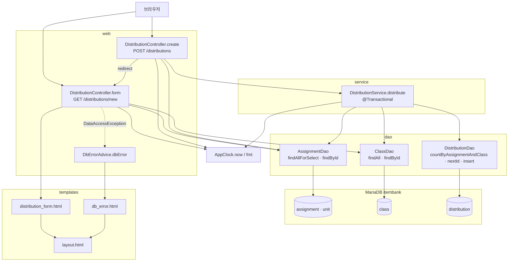

# legacy/assignment-thymeleaf 아키텍처 — 과제 배포 폼 화면

- 작성일: 2026-09-29
- 범위: 진입점 · 의존 관계. 데이터 흐름과 비즈니스 규칙 후보는 이 문서에 넣지 않았다.
  - **범위 제한:** "과제 배포 폼" 화면 하나(`GET /distributions/new` → `POST /distributions`)와 그 화면이 부르는 코드만 다룬다.
  - **제외:** 배포 목록 · 재배포 화면(`distributions.html`, `redistribute` 흐름), 과제 목록 화면(`assignments.html`, `AssignmentController`), 테스트, 빌드 설정.
- 근거 표기: `파일:줄번호`. 모듈 안 파일은 `legacy/assignment-thymeleaf/` 를 뺀 경로로, 모듈 밖 파일은 저장소 루트 기준 경로로 쓴다. 표 칸과 bullet 마다 첫 참조에는 파일 경로를 붙였다.
- 선행 문서: 없음(첫 문서)
- 작성 원칙
  - 코드에 있는 것만 적고, 주석과 코드가 다르면 코드를 기준으로 한다.
  - 설정 파일의 비밀번호 · 계정 · 접속 주소 값은 옮기지 않고 키 이름만 적는다.
  - 범위 밖 코드는 "범위 안 코드가 부르는 경계"까지만 적는다.

## 1. 모듈 개요

- Spring Boot + Thymeleaf 서버 렌더링 앱이다. 과제를 학급에 배포하는 화면들을 제공한다(`src/main/java/com/example/assign/AssignApplication.java:7-13`).
- 내장 서버 포트 키는 `server.port` 이고 값은 8080이다(`src/main/resources/application.properties:1`). compose 프로필 `thymeleaf` 로 뜨며 호스트 8082 → 컨테이너 8080 으로 노출된다(`docker-compose.yml:52`, `docker-compose.yml:54`).
- DB는 MariaDB `itembank` 를 JDBC(`org.mariadb.jdbc.Driver`)로 쓴다(`src/main/resources/application.properties:5`, `docker-compose.yml:61`).
  - 접속 주소 · 계정 · 비밀번호 키: `spring.datasource.url` · `spring.datasource.username` · `spring.datasource.password` (`src/main/resources/application.properties:2-4`). 값은 옮기지 않았다. `url` 은 환경 변수 `SPRING_DATASOURCE_URL` 로 덮어쓸 수 있는 형태다(`src/main/resources/application.properties:2`).
  - 커넥션 풀 키: `spring.datasource.hikari.maximum-pool-size`(4), `connection-timeout`(5000), `initialization-fail-timeout`(-1) (`src/main/resources/application.properties:6-8`).
- DB 접근은 JPA 없이 `JdbcTemplate` 직접 SQL이다(`src/main/java/com/example/assign/dao/ClassDao.java:14-18`).
- 이 화면의 "현재 시각"은 `AppClock.now()` 가 준다. 시스템 속성 `app.clock` 이 `system` 이 아니면 고정값 `2026-09-15 00:00:00` 을 돌려준다(`src/main/java/com/example/assign/AppClock.java:9`, `src/main/java/com/example/assign/AppClock.java:14-20`). 컨테이너 실행 명령에는 `-Dapp.clock` 이 없다(`legacy/assignment-thymeleaf/Dockerfile:11`, 범위 밖 파일을 이 한 줄만 확인). 따라서 compose 로 띄우면 시각은 고정값이다.

## 2. 폴더 구조 (범위에 든 파일만 표시)

```
legacy/assignment-thymeleaf/src/main/
├── java/com/example/assign/
│   ├── AppClock.java                 현재 시각(고정값 또는 시스템 시각) · 날짜 포맷
│   ├── web/DistributionController.java   폼 표시(GET) · 배포 등록(POST) — 범위 밖 메서드 포함
│   ├── web/DbErrorAdvice.java        DataAccessException → db_error 화면
│   ├── service/DistributionService.java  distribute() 만 범위 안 (701줄 중 47-68)
│   ├── dao/AssignmentDao.java        과제 조회 SQL
│   ├── dao/ClassDao.java             학급 조회 SQL
│   ├── dao/DistributionDao.java      배포 중복 확인 · 번호 채번 · 저장 SQL
│   └── model/AssignmentRow.java · ClassRow.java   조회 결과 값 객체
└── resources/
    ├── application.properties
    └── templates/ distribution_form.html · layout.html · db_error.html
```

- 범위 밖이라 읽지 않았거나 이 문서에서 제외한 파일: `AssignmentController.java`, `assignments.html`, `distributions.html`, `RedistributeResult.java`, `SubmissionRow.java`, `DistributionRow.java`, `DistributionService.java` 의 `distribute` 이외 메서드.

## 3. 진입점

| 진입점 | 파일 | 입력 | 처리 흐름 |
|---|---|---|---|
| `GET /distributions/new` (폼 표시) | `src/main/java/com/example/assign/web/DistributionController.java:40-47` | 없음 | ① `assignmentDao.findAllForSelect()` 로 선택 가능한 과제 목록 조회(`src/main/java/com/example/assign/web/DistributionController.java:42`) → ② `classDao.findAll()` 로 학급 목록 조회(`src/main/java/com/example/assign/web/DistributionController.java:43`) → ③ `AppClock.now()` 를 `now` 로 모델에 담음(`src/main/java/com/example/assign/web/DistributionController.java:44`) → ④ `menu=new` 를 담고 뷰 `distribution_form` 반환(`src/main/java/com/example/assign/web/DistributionController.java:45-46`) |
| `POST /distributions` (배포 등록) | `src/main/java/com/example/assign/web/DistributionController.java:49-77` | 폼 파라미터 `assignmentId`(long), `classId`(long) (`src/main/java/com/example/assign/web/DistributionController.java:50-51`) | ① 과제 조회, 없으면 오류 후 폼으로 리다이렉트(`src/main/java/com/example/assign/web/DistributionController.java:53-57`) → ② 마감 판정, 실패 시 오류 후 폼으로 리다이렉트(`src/main/java/com/example/assign/web/DistributionController.java:58-65`) → ③ `distributionService.distribute()` 호출(`src/main/java/com/example/assign/web/DistributionController.java:67`) → ④ 성공 시 `message` 플래시 후 `/distributions` 로 리다이렉트(`src/main/java/com/example/assign/web/DistributionController.java:68`, `src/main/java/com/example/assign/web/DistributionController.java:76`), `IllegalArgumentException` · `IllegalStateException` · `DataAccessException` 은 오류 플래시 후 폼으로 리다이렉트(`src/main/java/com/example/assign/web/DistributionController.java:69-75`) |
| 화면(뷰) `distribution_form` | `src/main/resources/templates/distribution_form.html:1-34` | 모델 `assignments` · `classes` · `now` · `menu`, 플래시 `message` · `error` · `warnings` | 과제 select(`src/main/resources/templates/distribution_form.html:11-19`) · 학급 select(`src/main/resources/templates/distribution_form.html:23-26`) · 제출 버튼이 있는 form 을 `POST /distributions` 로 보낸다(`src/main/resources/templates/distribution_form.html:8`) |
| 예외 진입점 (`DataAccessException`) | `src/main/java/com/example/assign/web/DbErrorAdvice.java:11-17` | 컨트롤러에서 처리하지 않은 `DataAccessException` | 콘솔 출력 후 `db_error` 뷰 반환(`src/main/java/com/example/assign/web/DbErrorAdvice.java:13`, `src/main/java/com/example/assign/web/DbErrorAdvice.java:16`). 이 화면에서는 `GET /distributions/new` 의 DB 예외가 여기로 온다. `POST` 는 컨트롤러가 직접 잡는다(`src/main/java/com/example/assign/web/DistributionController.java:72-75`). |

- 화면 조각(fragment): `distribution_form.html` 은 `layout.html` 의 `head` · `nav` · `flash` · `footer` 조각을 가져다 쓴다(`src/main/resources/templates/distribution_form.html:3`, `src/main/resources/templates/distribution_form.html:5`, `src/main/resources/templates/distribution_form.html:7`, `src/main/resources/templates/distribution_form.html:32`). 정의는 `src/main/resources/templates/layout.html:3`, `src/main/resources/templates/layout.html:23`, `src/main/resources/templates/layout.html:28`, `src/main/resources/templates/layout.html:35` 이다.

## 4. 의존 관계 (호출하는 쪽 → 호출되는 쪽)

### 4.1 호출 목록

| 호출하는 쪽 | 호출되는 쪽 | 종류 | 근거 |
|---|---|---|---|
| `DistributionController.form` | `AssignmentDao.findAllForSelect` | 메서드 호출 | `src/main/java/com/example/assign/web/DistributionController.java:42` |
| `DistributionController.form` | `ClassDao.findAll` | 메서드 호출 | `src/main/java/com/example/assign/web/DistributionController.java:43` |
| `DistributionController.form` · `create` | `AppClock.now` | 정적 호출 | `src/main/java/com/example/assign/web/DistributionController.java:44`, `src/main/java/com/example/assign/web/DistributionController.java:58` |
| `DistributionController.create` | `AssignmentDao.findById` | 메서드 호출 | `src/main/java/com/example/assign/web/DistributionController.java:53` |
| `DistributionController.create` | `AppClock.fmt` | 정적 호출 | `src/main/java/com/example/assign/web/DistributionController.java:62` |
| `DistributionController.create` | `DistributionService.distribute` | 메서드 호출 | `src/main/java/com/example/assign/web/DistributionController.java:67` |
| `DistributionService.distribute` | `AssignmentDao.findById` | 메서드 호출 | `src/main/java/com/example/assign/service/DistributionService.java:48` |
| `DistributionService.distribute` | `ClassDao.findById` | 메서드 호출 | `src/main/java/com/example/assign/service/DistributionService.java:52` |
| `DistributionService.distribute` | `DistributionDao.countByAssignmentAndClass` | 메서드 호출 | `src/main/java/com/example/assign/service/DistributionService.java:59` |
| `DistributionService.distribute` | `DistributionDao.nextId` | 메서드 호출 | `src/main/java/com/example/assign/service/DistributionService.java:62` |
| `DistributionService.distribute` | `DistributionDao.insert` · `AppClock.now` | 메서드 · 정적 호출 | `src/main/java/com/example/assign/service/DistributionService.java:63` |
| `AssignmentDao` · `ClassDao` · `DistributionDao` | DB(`JdbcTemplate`) | SQL | `src/main/java/com/example/assign/dao/AssignmentDao.java:21-24`, `src/main/java/com/example/assign/dao/ClassDao.java:21`, `src/main/java/com/example/assign/dao/DistributionDao.java:47-63` |
| `DistributionDao` 를 쓰는 서비스의 트랜잭션 | Spring `@Transactional` | 어노테이션 | `src/main/java/com/example/assign/service/DistributionService.java:46` |
| `distribution_form.html` | `layout.html` 조각 4개 | 템플릿 포함 | `src/main/resources/templates/distribution_form.html:3`, `src/main/resources/templates/distribution_form.html:5`, `src/main/resources/templates/distribution_form.html:7`, `src/main/resources/templates/distribution_form.html:32` |
| `DbErrorAdvice.dbError` → `db_error.html` → `layout.html` | 뷰 렌더링 | 템플릿 포함 | `src/main/java/com/example/assign/web/DbErrorAdvice.java:16`, `src/main/resources/templates/db_error.html:3`, `src/main/resources/templates/db_error.html:5`, `src/main/resources/templates/db_error.html:9` |

- 컨트롤러가 서비스와 DAO 를 둘 다 직접 부른다. 생성자 주입 대상이 `DistributionService` · `AssignmentDao` · `ClassDao` 이다(`src/main/java/com/example/assign/web/DistributionController.java:26-30`). 계층을 건너뛰는 호출이다.
- `POST` 의 과제 조회 · 마감 판정은 컨트롤러가 트랜잭션 밖에서 하고(`src/main/java/com/example/assign/web/DistributionController.java:53-65`), 서비스 `distribute` 가 같은 과제를 트랜잭션 안에서 다시 조회한다(`src/main/java/com/example/assign/service/DistributionService.java:48`). 조회가 두 번 일어난다.

### 4.2 흐름도



## 5. 가장 긴 함수 3개 (범위 안 메서드 기준)

이관 때 먼저 쪼갤 후보를 보려는 표다. 범위 안에서 호출되는 메서드만 순위에 넣었다. 범위 밖 메서드는 순위에서 뺐다. 예를 들어 `DistributionService.redistribute`(`src/main/java/com/example/assign/service/DistributionService.java:72` 부터 시작하는 긴 메서드)는 재배포 화면 소속이라 제외했다. 줄 수는 시그니처 줄부터 닫는 중괄호까지 센다.

| 순위 | 파일 | 함수 | 시작~끝 줄 | 줄 수 | 하는 일 |
|---|---|---|---|---|---|
| 1 | `src/main/java/com/example/assign/web/DistributionController.java` | `create` | 50~77 | 28 | 과제 존재 · 마감 판정 후 서비스 호출, 예외별로 플래시 메시지 설정 |
| 2 | `src/main/java/com/example/assign/service/DistributionService.java` | `distribute` | 47~68 | 22 | 과제 · 학급 존재, 삭제 상태, 중복 배포를 검사하고 새 번호로 저장 |
| 3 | `src/main/java/com/example/assign/dao/AssignmentDao.java` | `MAPPER.mapRow` (익명 클래스) | 52~64 | 13 | 과제 조회 결과 행을 `AssignmentRow` 로 변환 |

- 함수 없이 위에서 아래로 실행되는 스크립트는 이 모듈의 범위 안에 없다(템플릿은 선언형이라 제외).

## 6. 미확인 목록

| # | 항목 | 이유 |
|---|---|---|
| U-1 | `app.clock=system` 으로 실행하는 경로가 있는지 | 범위 안 코드와 `Dockerfile` 에는 설정이 없다(`legacy/assignment-thymeleaf/Dockerfile:11`). 다른 실행 스크립트 · IDE 설정은 보지 않았다. |
| U-2 | 과제 `status` 코드 `X`(연장) · `D`(삭제) · `R`(검수중)이 DB에 실제로 존재하는지 | 스키마 주석은 `O`, `C` 만 적었고(`db/mariadb/init/01-schema.sql:87`), 시드 데이터도 `O`, `C` 만 쓴다(`db/mariadb/init/02-seed.sql:119-125`). 코드는 `X` · `D` 를 분기한다. 상세는 ERD 문서에 적는다. |
| U-3 | 동시에 두 요청이 들어올 때의 동작 | 배포 번호를 `MAX(id)+1` 로 만들고(`src/main/java/com/example/assign/dao/DistributionDao.java:54-57`) `distribution` 에 (과제, 학급) 유일 제약이 없다(`db/mariadb/init/01-schema.sql:92-103`). 기본 키 충돌이나 중복 저장이 실제로 나는지는 실행해 보지 않았다. |
| U-4 | `DistributionService` 의 `@Transactional` 이 실제 트랜잭션으로 동작하는지 | 트랜잭션 관리자 설정을 범위 안에서 확인하지 않았다(Spring Boot 자동 구성에 기대는 것으로 추정). |
| U-5 | MS-SQL 쪽 `assignment` · `class` 테이블과의 관계 | 이 모듈은 MariaDB(`jdbc:mariadb`)를 쓴다(`src/main/resources/application.properties:5`). `db/mssql/init/01-schema.sql:21-22`, `db/mssql/init/01-schema.sql:54-55` 에도 같은 이름의 테이블이 있으나 컬럼이 달라 이 모듈이 쓰는 대상이 아니라고 판단했다. 코드 · 설정으로 이 모듈이 MS-SQL 에 접속하지 않음은 확인했다. |
