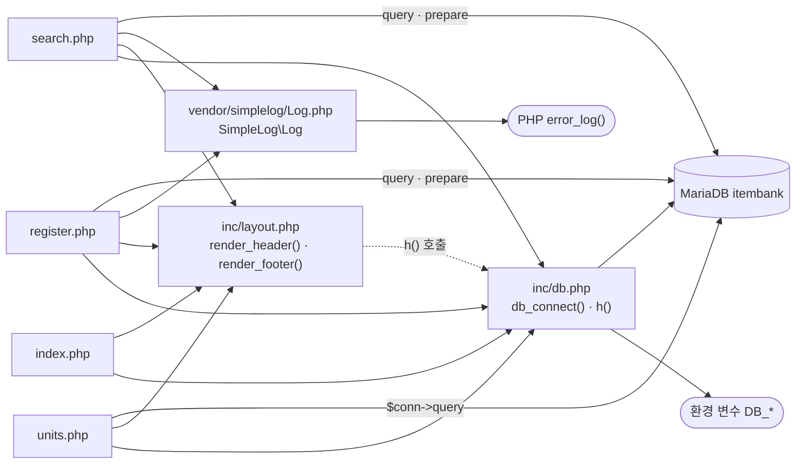

# legacy/item-bank-php 아키텍처

- 작성일: 2026-09-29
- 범위: 분석 계획의 1단계(진입점) · 2단계(의존 관계)까지다. 데이터 흐름(3단계)과 비즈니스 규칙 후보(4단계)는 이 문서에 넣지 않았다.
- 근거는 `파일:줄번호` 로 적는다. 모듈 안 파일은 `legacy/item-bank-php/` 를 뺀 경로로 쓴다.

## 1. 모듈 개요

- 문항을 검색 · 등록하고 단원 목록을 보여 주는 PHP 화면 모듈이다(`index.php:9-11`).
- PHP 7.4 + Apache 이미지이며, 모듈 폴더를 그대로 `/var/www/html/` 에 복사해 실행한다(`Dockerfile:1`, `:14`).
- compose 프로필 `php` 로 뜨고 8081 → 80 으로 노출된다(`docker-compose.yml:37`, `:39`).
- DB는 mysqli로 MariaDB(`itembank`)에 접속하고, 접속 정보는 환경 변수로 받는다(`inc/db.php:14-21`, `docker-compose.yml:41-45`).
- 프레임워크나 라우터가 없다. 화면 PHP 파일 4개가 곧 진입점이고, 공통 코드는 `inc/` 두 파일과 로거 1개다.

## 2. 폴더 구조

```
legacy/item-bank-php/          파일 8개, 1,120줄 (숨김 파일 · .htaccess 없음)
├── Dockerfile                 16줄   php:7.4-apache, mysqli, display_errors=Off
├── index.php                  14줄   홈(메뉴)
├── units.php                  48줄   단원 목록
├── register.php              177줄   문항 등록 (함수 없는 절차형 스크립트)
├── search.php                731줄   문항 검색 (함수 4개 + 실행부)
├── inc/
│   ├── db.php                 37줄   db_connect(), h()
│   └── layout.php             43줄   render_header(), render_footer()
└── vendor/
    └── simplelog/Log.php      54줄   SimpleLog\Log (외부 라이브러리 더미, error_log로만 기록)
```

모듈 밖 관련 파일:

- `docker-compose.yml` 의 `item-bank` 서비스 — 빌드 경로 · 포트 · DB 환경 변수(`docker-compose.yml:35-48`)
- `db/mariadb/init/01-schema.sql` · `02-seed.sql` · `03-users.sql` — DB 초기화 스크립트(`docker-compose.yml:25`). 내용은 이 문서 범위 밖이다.

## 3. 진입점

| 화면 (URL) | 처음 실행되는 파일 | 요청 방식 · 입력 | 그 파일이 부르는 주요 함수 |
|---|---|---|---|
| 홈 (`/index.php`) | `index.php` | 없음 | `render_header('홈')`(`index.php:5`) → `render_footer()`(`index.php:14`) |
| 단원 목록 (`/units.php`) | `units.php` | 없음 | `render_header`(`units.php:5`) → `db_connect`(`units.php:8`) → `$conn->query`(`units.php:20`) → `h()`(`units.php:40-43`) → `render_footer`(`units.php:48`) |
| 문항 등록 (`/register.php`) | `register.php` | GET은 폼 표시, POST는 저장. 입력 `title` · `stem` · `unit_id` · `level` · `tags[]`(`register.php:40-45`) | `db_connect`(`:17`) → `$conn->query` 2회(`:27`, `:34`) → POST일 때 `begin_transaction`(`:85`) · 채번 `$conn->query`(`:87`) · `prepare`/`bind_param`(`:92-98`, `:105-107`) · `commit`(`:114`) / `rollback`(`:120`) · `Log::info`(`:115`) / `Log::error`(`:121`) → `render_header`(`:127`) → `render_footer`(`:177`) |
| 문항 검색 (`/search.php`) | `search.php` | GET. 입력 `q` · `unit` · `level` · `tag` · `sort` · `dir` · `page`(`search.php:5-12`, 주석 근거) | `render_header`(`:709`) → `db_connect`(`:713`) → `buildSearchQuery($_GET, $conn)`(`:722`) → `renderSearchForm`(`:723`) → `runSearchQuery`(`:724`) → `renderResultTable`(`:725`) → 실패 시 `Log::error`(`:727`) → `render_footer`(`:731`) |

화면 간 이동:

- `index.php` 와 `inc/layout.php` 의 메뉴가 세 화면으로 링크한다(`index.php:9-11`, `inc/layout.php:10-12`, `:30`).
- 검색 · 등록 화면은 자기 자신으로 다시 요청한다(`search.php:414`, `:430`, `:632`, `register.php:141`).

## 4. 의존 관계

### 4.1 흐름도

실선은 `require_once` 또는 함수 호출, 점선은 파일 자신이 포함하지 않고 호출하는 **숨은 의존**이다.



### 4.2 파일 포함 (`require_once`)

| A → B (A가 B를 포함) | 근거 |
|---|---|
| `index.php` → `inc/db.php` | `index.php:2` |
| `index.php` → `inc/layout.php` | `index.php:3` |
| `units.php` → `inc/db.php` | `units.php:2` |
| `units.php` → `inc/layout.php` | `units.php:3` |
| `register.php` → `inc/db.php` | `register.php:2` |
| `register.php` → `inc/layout.php` | `register.php:3` |
| `register.php` → `vendor/simplelog/Log.php` | `register.php:4` |
| `search.php` → `inc/db.php` | `search.php:20` |
| `search.php` → `inc/layout.php` | `search.php:21` |
| `search.php` → `vendor/simplelog/Log.php` | `search.php:22` |

### 4.3 함수 호출

| A → B (A가 B를 호출) | 근거 |
|---|---|
| 화면 4개 → `render_header` · `render_footer` (`inc/layout.php:7`, `:38`) | `index.php:5`, `:14` / `units.php:5`, `:48` / `register.php:127`, `:177` / `search.php:709`, `:731` |
| `units.php` · `register.php` · `search.php` → `db_connect` (`inc/db.php:7`) | `units.php:8`, `register.php:17`, `search.php:713` |
| 화면 → `h()` (`inc/db.php:34`) | `units.php:10`, `register.php:131`, `search.php:674-678` 등 |
| `inc/layout.php` → `h()` (`inc/db.php:34`) — **숨은 의존** | `inc/layout.php:17`, `:33` |
| `register.php` → `Log::info` · `Log::error` | `register.php:115`, `:121` |
| `search.php` → `Log::setThreshold` · `Log::debug` · `Log::error` | `search.php:27` / `:103`, `:528` / `:537`, `:727` |
| `Log::debug/info/warn/error` → `Log::write` → `error_log()` | `vendor/simplelog/Log.php:23-52` |
| `search.php` 실행부 → `buildSearchQuery` · `renderSearchForm` · `runSearchQuery` · `renderResultTable` | `search.php:722-725` |
| `buildSearchQuery` → `$conn->prepare` / `$conn->query` | `search.php:125`, `:156`, `:178` |
| `buildSearchQuery` → `h()` | `search.php:360` 외 다수 |
| `inc/db.php` → 환경 변수 `DB_HOST` · `DB_PORT` · `DB_NAME` · `DB_USER` · `DB_PASS`(없으면 기본값) | `inc/db.php:14-18` |

### 4.4 DB 객체 호출

| 파일 | 대상 | 근거 |
|---|---|---|
| `units.php` | `unit`, `item` | `units.php:16-19` |
| `register.php` | 조회 `unit` · `tag` / 등록 `item` · `item_tag` | `register.php:27`, `:34`, `:87`, `:93`, `:105` |
| `search.php` | `unit`, `tag`, `item_tag`, `v_item_public`(뷰) | `search.php:125`, `:156`, `:178`, `:244-245`, `:522` |

### 4.5 주의할 점

- **숨은 의존:** `inc/layout.php` 는 `inc/db.php` 를 포함하지 않는데 `h()` 를 호출한다(`inc/layout.php:17`, `:33`). 지금은 화면 4개가 모두 `db.php` 를 먼저 포함해서 동작한다(`index.php:2-3` 등). include 순서가 바뀌거나 `layout.php` 만 따로 포함하면 "정의되지 않은 함수" 오류가 난다.
- **연결 재사용:** `db_connect` 는 연결을 `static` 변수에 담아 한 요청 안에서 재사용한다(`inc/db.php:9-12`).

## 5. 가장 긴 함수 3개

| 순위 | 파일 | 함수 | 시작~끝 줄 | 줄 수 | 하는 일 |
|---|---|---|---|---|---|
| 1 | `search.php` | `buildSearchQuery` | 42~564 (`search.php:42`, `:564`) | 523 | GET 파라미터로 검색 SQL · 건수 SQL · 바인딩 값을 만들고, 요약 · 정렬 링크 · 페이지 링크 · 폼 HTML까지 조립해 배열로 돌려준다(`:29-36`, `:541-563`) |
| 2 | `search.php` | `renderResultTable` | 647~704 (`search.php:647`, `:704`) | 58 | 경고 · 요약 · 건수 · 결과 표 · 페이지 이동 링크를 출력하고, 0건이면 안내 문구만 출력한다(`:652-703`) |
| 3 | `search.php` | `runSearchQuery` | 571~624 (`search.php:571`, `:624`) | 54 | 건수 쿼리와 목록 쿼리를 prepare → 동적 `bind_param` → 실행해 `total` · `rows` 를 돌려준다(`:577-623`) |

- 그다음은 `render_header`(`inc/layout.php:7-36`, 30줄), `db_connect`(`inc/db.php:7-29`, 23줄)다.
- `buildSearchQuery` 안에 다른 함수 선언은 없다(42~564 구간의 `function` 은 42줄 한 곳).
- `register.php` · `units.php` 는 함수 없이 위에서 아래로 실행되는 스크립트라 순위에서 뺐다. `register.php`(177줄)가 사실상 가장 긴 절차 흐름이다.
- `buildSearchQuery` 의 "하는 일"은 함수 주석(`search.php:29-36`)과 반환 배열(`search.php:541-563`)을 근거로 적었다. 내부 로직은 3단계(데이터 흐름) 범위다.

## 6. 미확인 목록

- `/` 요청이 `index.php` 로 연결되는지 — 베이스 이미지의 DirectoryIndex 설정을 열어 보지 않았다.
- 이미지 쪽 rewrite 규칙 — `a2enmod rewrite` 는 켜져 있지만(`Dockerfile:3`) 모듈 안에 rewrite 규칙은 없다. 이미지 설정은 확인하지 않았다.
- DB 테이블 · 뷰(`unit` · `item` · `tag` · `item_tag` · `v_item_public`)의 정의 — 이 문서는 호출 위치만 적었다. → `docs/item-bank/ERD.md` §1 · §2에서 확인했다(`db/mariadb/init/01-schema.sql:11-70`).
