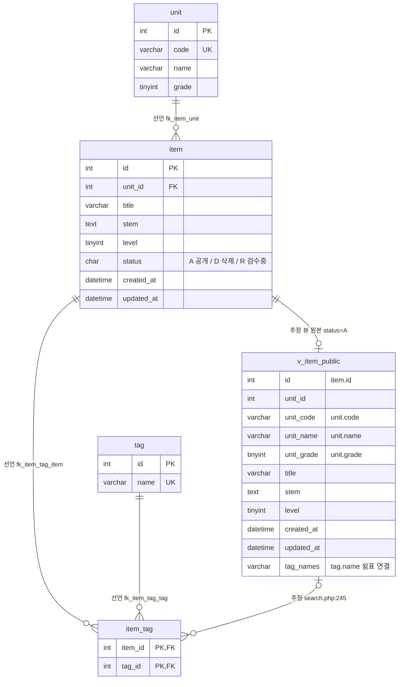

# legacy/item-bank-php 데이터 흐름 · ERD

- 작성일: 2026-09-29
- 범위: 분석 계획의 3단계(데이터 흐름)다. 대상은 `legacy/item-bank-php` 가 접근하는 MariaDB `itembank` 의 테이블 · 뷰다. 비즈니스 규칙 후보(4단계)는 넣지 않았다. 다만 데이터 흐름을 읽다가 눈에 띈 2건만 §5에 적어 두었다.
- 근거는 `파일:줄번호` 로 적는다. 모듈 안 파일은 `legacy/item-bank-php/` 를 뺀 경로(예: `search.php:522`)로 쓰고, 모듈 밖 파일은 저장소 루트 기준 경로(예: `db/mariadb/init/01-schema.sql:11`)로 쓴다.
- 스키마 근거는 초기화 스크립트 `db/mariadb/init/01-schema.sql` 이다. 실행 중인 DB는 조회하지 않았다(§6).
- 선행 문서: `docs/item-bank/ARCHITECTURE.md`(진입점 · 의존 관계)

## 1. 테이블 목록

모듈이 접근하는 테이블 4개와 뷰 1개다. 모듈 코드에 `CREATE`/`ALTER` 문은 없다.

| 이름 | 종류 | 주요 컬럼 | 키 · 제약 | 스키마 근거 | 모듈 안 SQL 근거 |
|---|---|---|---|---|---|
| `unit` | 테이블 | `id` INT, `code` VARCHAR(16), `name` VARCHAR(100), `grade` TINYINT | PK `id`, UK `uk_unit_code(code)` | `db/mariadb/init/01-schema.sql:11-18` | `units.php:16-19`, `register.php:27`, `search.php:125`, `:156` |
| `item` | 테이블 | `id` INT, `unit_id` INT, `title` VARCHAR(200), `stem` TEXT, `level` TINYINT(1~5), `status` CHAR(1) 기본 `'A'`(A=공개 D=삭제 R=검수중), `created_at` DATETIME, `updated_at` DATETIME | PK `id`(AUTO_INCREMENT 없음), IDX `idx_item_unit`, `idx_item_level`, FK `fk_item_unit` | `db/mariadb/init/01-schema.sql:20-33` | `units.php:17`, `register.php:87`, `:93-94` |
| `tag` | 테이블 | `id` INT, `name` VARCHAR(50) | PK `id`, UK `uk_tag_name(name)` | `db/mariadb/init/01-schema.sql:35-40` | `register.php:34`, `search.php:178`, `:244` |
| `item_tag` | 테이블(조인) | `item_id` INT, `tag_id` INT | PK `(item_id, tag_id)`, FK `fk_item_tag_item`, `fk_item_tag_tag` | `db/mariadb/init/01-schema.sql:42-48` | `register.php:105`, `search.php:244-245` |
| `v_item_public` | 뷰 | `id`, `unit_id`, `unit_code`, `unit_name`, `unit_grade`, `title`, `stem`, `level`, `created_at`, `updated_at`, `tag_names`(태그 이름을 `tag.id` 순으로 `,` 연결) | 조건 `i.status = 'A'` | `db/mariadb/init/01-schema.sql:52-70` | `search.php:521-522`, `:526` |

- `v_item_public` 의 원본: `item i JOIN unit u ON u.id = i.unit_id`, `tag_names` 는 `item_tag JOIN tag` 상관 서브쿼리다(`db/mariadb/init/01-schema.sql:64-69`).
- `item.id` 는 AUTO_INCREMENT가 아니라서(`db/mariadb/init/01-schema.sql:21`) 등록 화면이 직접 번호를 매긴다(§3 `register.php:87`).

## 2. 테이블 관계

### 2.1 ERD

라벨의 첫 단어가 구분이다. **선언** = 스키마에 FOREIGN KEY로 선언됨, **추정** = FK 선언 없이 코드의 JOIN · 상관 조건에서 추정함.

### 2.2 관계 근거

| 관계 | 구분 | FK 선언 근거 | 코드 JOIN · 상관 조건 근거 |
|---|---|---|---|
| `item.unit_id` → `unit.id` (N:1) | 선언 | `db/mariadb/init/01-schema.sql:32` | `db/mariadb/init/01-schema.sql:69`(뷰 JOIN), `units.php:17`(`i.unit_id = u.id`) |
| `item_tag.item_id` → `item.id` (N:1) | 선언 | `db/mariadb/init/01-schema.sql:46` | `db/mariadb/init/01-schema.sql:67`(뷰 서브쿼리 `it.item_id = i.id`) |
| `item_tag.tag_id` → `tag.id` (N:1) | 선언 | `db/mariadb/init/01-schema.sql:47` | `db/mariadb/init/01-schema.sql:66`, `search.php:244`(`t.id = it.tag_id`) |
| `v_item_public.id` = `item.id` (공개 문항만 1:0..1) | 추정 | 없음(뷰에는 FK가 없다) | `db/mariadb/init/01-schema.sql:54`, `:68`, `:70`(`SELECT i.id … FROM item i … WHERE i.status = 'A'`) |
| `item_tag.item_id` → `v_item_public.id` (N:0..1) | 추정 | 없음 | `search.php:245`(`it.item_id = v_item_public.id`). 검수중 문항의 태그 행은 뷰에 짝이 없다 — 등록이 `status='R'` 로 넣고(`register.php:94`, `:105`) 뷰는 `'A'` 만 담는다(`db/mariadb/init/01-schema.sql:70`) |

- 코드의 테이블 간 JOIN은 모두 선언된 FK와 같은 컬럼 쌍을 쓴다. **FK 없이 코드에서만 추정되는 테이블 간 관계는 없다.** 추정 관계 2건은 뷰를 거치는 관계다.
- `search.php:118` 의 `unit_code = ?` 는 JOIN이 아니라 뷰 컬럼(`unit.code`, UK)에 거는 검색 조건이다.

## 3. 읽기 · 쓰기 위치

`register.php` · `units.php` 는 함수 없이 위에서 아래로 실행되는 스크립트라 함수 칸에 `(최상위)` 로 적었다. `search.php` 는 SQL을 **조립하는 함수**와 **실행하는 함수**가 달라서 둘 다 적었다.

### 3.1 테이블별 요약

| 테이블 | 읽기(SELECT) | 쓰기(INSERT · UPDATE · DELETE) |
|---|---|---|
| `unit` | `units.php` (최상위) · `register.php` (최상위) · `search.php` `buildSearchQuery` ×2 · `search.php` `runSearchQuery` (뷰 경유) | 없음 |
| `item` | `units.php` (최상위) · `register.php` (최상위, 채번용 잠금 조회) · `search.php` `runSearchQuery` (뷰 경유) | INSERT: `register.php` (최상위). UPDATE · DELETE 없음 |
| `tag` | `register.php` (최상위) · `search.php` `buildSearchQuery` · `search.php` `runSearchQuery` (EXISTS 조건 + 뷰 경유) | 없음 |
| `item_tag` | `search.php` `runSearchQuery` (EXISTS 조건 + 뷰 경유) | INSERT: `register.php` (최상위). UPDATE · DELETE 없음 |
| `v_item_public` | `search.php` `runSearchQuery` (건수 · 목록) | 해당 없음(뷰) |

### 3.2 상세 — 읽기

| 테이블 | 파일 · 함수 | SQL 위치 | 읽는 컬럼 · 조건 | 용도 |
|---|---|---|---|---|
| `unit` | `units.php` (최상위) | `units.php:16-20` | `id, code, name, grade`, `ORDER BY grade, code` | 단원 목록 표 |
| `unit` | `register.php` (최상위) | `register.php:27` | `id, code, name`, `ORDER BY grade, code` | 단원 선택 목록 + 입력 `unit_id` 검증(`register.php:61-65`) |
| `unit` | `search.php` `buildSearchQuery` (조립 · 실행 같은 함수) | `search.php:125-128` | `name, grade WHERE code = ?` | 검색 요약의 단원 이름, 없는 코드면 경고(`:141-142`) |
| `unit` | `search.php` `buildSearchQuery` | `search.php:156` | `code, name, grade`, `ORDER BY grade, code` | 검색 폼 단원 선택 목록 |
| `unit` | `search.php` `runSearchQuery` (뷰 경유) | 조립 `search.php:521-526`, 실행 `:577`, `:600` | 뷰의 `unit_code` | 검색 결과 · 단원 조건(`:118`) |
| `item` | `units.php` (최상위) | `units.php:17` | `COUNT(*) WHERE i.unit_id = u.id AND i.status = 'A'` | 단원별 공개 문항 수 |
| `item` | `register.php` (최상위) | `register.php:87` | `COALESCE(MAX(id), 0) + 1 … FOR UPDATE` | 새 문항 id 채번. 트랜잭션(`:85`) 안의 잠금 조회 |
| `item` | `search.php` `runSearchQuery` (뷰 경유) | 조립 `search.php:521-526`, 실행 `:577`, `:600` | 뷰의 `id, title, level, created_at` 조회, `title` · `stem` LIKE(`:98`), `level` 조건(`:213-229`), 정렬(`:279-325`) | 검색 건수 · 목록(20건 페이지, `:523`) |
| `tag` | `register.php` (최상위) | `register.php:34` | `id, name`, `ORDER BY id` | 태그 체크박스 + 입력 `tags[]` 검증(`register.php:74-81`) |
| `tag` | `search.php` `buildSearchQuery` | `search.php:178` | `name`, `ORDER BY id` | 검색 폼 태그 선택 목록, 미등록 태그 경고(`:251-260`) |
| `tag` | `search.php` `runSearchQuery` | 조립 `search.php:244-245`, 실행 `:577`, `:600` | `EXISTS (… JOIN tag t … AND t.name = ?)` | 태그 이름 일치 조건 |
| `tag` | `search.php` `runSearchQuery` (뷰 경유) | 실행 `search.php:577`, `:600` | 뷰의 `tag_names`(`db/mariadb/init/01-schema.sql:64-67`) | 결과 표 태그 칸(`search.php:678`) |
| `item_tag` | `search.php` `runSearchQuery` | 조립 `search.php:244-245`, 실행 `:577`, `:600` | `EXISTS (SELECT 1 FROM item_tag it … WHERE it.item_id = v_item_public.id …)` | 태그 조건 |
| `item_tag` | `search.php` `runSearchQuery` (뷰 경유) | 실행 `search.php:577`, `:600` | 뷰의 `tag_names` 서브쿼리 | 결과 표 태그 칸 |
| `v_item_public` | `search.php` `runSearchQuery` | 조립 `search.php:521-526`, 실행 `:577`(건수), `:600`(목록) | `SELECT id, title, unit_code, level, tag_names, created_at`, WHERE `title` · `stem` · `unit_code` · `level` · 태그 EXISTS | 문항 검색 |

- `v_item_public` 컬럼 중 `unit_id` · `unit_name` · `unit_grade` · `updated_at` 은 `search.php` 에서 읽지 않는다(`search.php:521` SELECT 목록, WHERE · ORDER BY 조립 `:98`-`:325` 기준).
- `index.php` · `inc/layout.php` · `inc/db.php` · `vendor/simplelog/Log.php` 에는 SQL이 없다.

### 3.3 상세 — 쓰기

| 테이블 | 파일 · 함수 | SQL 위치 | 쓰는 컬럼 · 값 | 트랜잭션 |
|---|---|---|---|---|
| `item` | `register.php` (최상위, POST이고 검증 오류가 없을 때 `:40`, `:83`) | `register.php:92-98` | INSERT `id`(채번값), `unit_id`, `title`, `stem`, `level`, `status = 'R'`(리터럴), `created_at = NOW()`, `updated_at = NOW()` | `begin_transaction`(`:85`) → `commit`(`:114`), 예외 시 `rollback`(`:120`) |
| `item_tag` | `register.php` (최상위, 유효 태그가 1개 이상일 때 `:104`) | `register.php:105-111` | INSERT `(item_id, tag_id)` 태그마다 1행 | 위와 같은 트랜잭션 |

- 쓰기 흐름: 채번 잠금 조회(`register.php:87`) → `item` INSERT(`:92-102`) → `item_tag` INSERT 반복(`:104-113`) → commit(`:114`) → `Log::info`(`:115`).
- 모듈 안에 UPDATE · DELETE 문은 없다. `unit` · `tag` 에 쓰는 코드도 없다. 네 테이블의 초기 데이터는 시드 스크립트가 넣는다(`db/mariadb/init/02-seed.sql:9`, `:19`, `:36`, `:76`).

## 4. 모듈이 쓰지 않는 테이블

- 같은 스키마의 `class` · `assignment` · `distribution` · `submission`(`db/mariadb/init/01-schema.sql:75-115`)은 이 모듈이 읽지도 쓰지도 않는다. 주석상 assignment-thymeleaf 모듈이 쓴다(`db/mariadb/init/01-schema.sql:73`).
- `assignment.unit_id` 가 `unit.id` 를 FK로 참조한다(`fk_assignment_unit`, `db/mariadb/init/01-schema.sql:89`). 즉 `unit` 은 다른 모듈과 함께 쓰는 테이블이다.

## 5. 참고 — 4단계 후보 관찰

- `search.php:213-215`: 주석은 "난이도 값이 비어 있으면 1~5 모두 포함"인데, 코드는 `AND level < 5` 를 붙여 난이도 5 문항을 뺀다. 시드 주석도 이 조건을 전제로 한다(`db/mariadb/init/02-seed.sql:34`). 규칙인지 결함인지는 4단계에서 판단한다.
- `register.php:87`: `FOR UPDATE` 가 붙은 `MAX(id)` 조회로 채번한다. 동시 등록 요청에서 어떻게 잠기는지는 실행해서 확인하지 않았다.

## 6. 미확인 목록

- **`item.status` 전환 주체**: 등록은 `'R'` 로 넣는다(`register.php:94`). `'R'` → `'A'`(공개) · `'D'`(삭제)로 바꾸는 코드를 찾지 못했다.
  - 검색 패턴: `(update|delete from|insert into)\s+(item|unit|tag|item_tag)\b`(대소문자 무시)
  - 검색 범위: `legacy/` · `modern/api/src` · `characterization/`
  - 결과: `register.php:93`, `:105` 두 건만 나왔다.
- **`item.updated_at` 갱신 경로**: INSERT 때 `NOW()` 외에 값을 바꾸는 코드가 없다(위와 같은 검색).
- **`unit` · `tag` 쓰기 경로**: 시드 외에 등록 · 수정하는 코드를 찾지 못했다(위와 같은 검색).
- **실행 중인 DB와 초기화 스크립트의 일치 여부**: 파일만 읽었고 DB를 조회하지 않았다.
  - `db/mariadb/` 에서 `trigger` · `procedure` · `auto_increment` 를 검색했더니 결과가 없었다.
  - 운영 · 로컬 DB에 트리거나 프로시저가 따로 있는지는 확인하지 않았다.
- **스키마 주석과 코드의 불일치**: 뷰 주석은 "검색 화면과 등록 화면이 모두 이 뷰를 기준으로 삼는다"고 적었다(`db/mariadb/init/01-schema.sql:51`). 그런데 `register.php` 는 `v_item_public` 을 참조하지 않고 `item` · `item_tag` 에 직접 쓴다(`register.php:87`, `:93`, `:105`). 주석이 뜻한 게 무엇인지는 확인하지 못했다.
